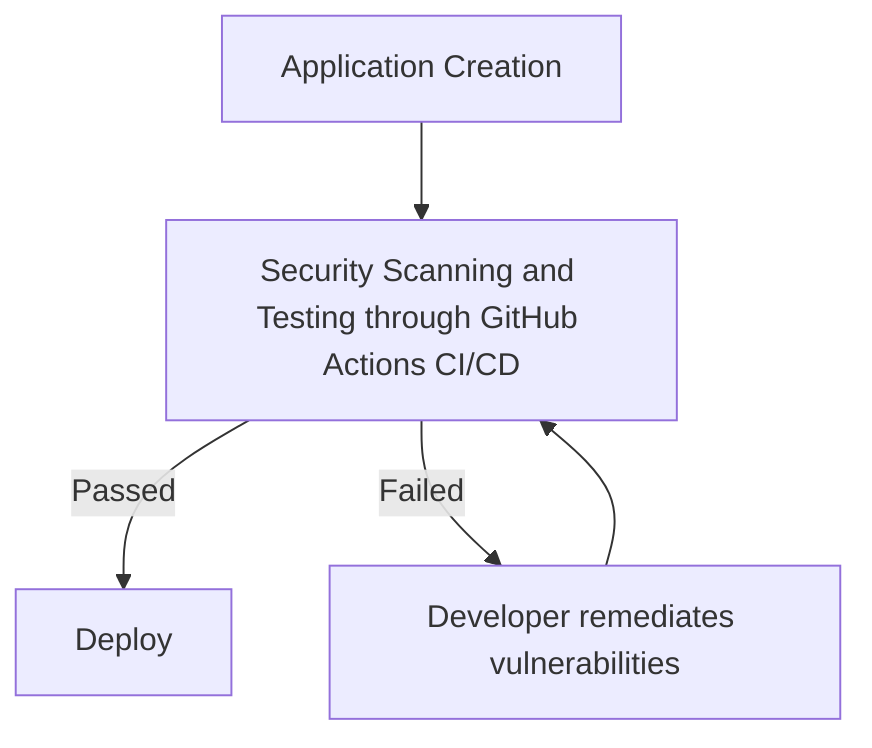
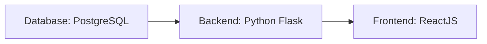
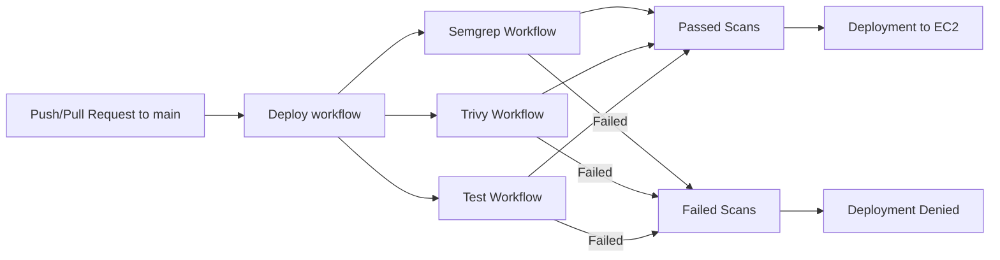

# OddJobs - Secure Software Deployment Pipeline

The goal of this project is to mimic and document the flow of full-stack application creation and secure deployment through a cloud service provider. The critical elements of this workflow include the following:

1. My Web Application (Titled: Odd Jobs)
2. CI/CD Pipeline (GitHub Actions)
3. Cloud provider service for deployment (AWS EC2)

## Project Workflow

The deployment of OddJobs will follow this workflow:

## Odd Jobs

OddJobs is a platform for those who need capable handyman work done in their homes or workplace. Whether you need a shelf fixed, a tv mounted, or a hole in the wall filled, this is the place for you.

This web application allows users to, upon signing up or logging in, to post jobs for things they need fixed or to sign up to complete jobs for other users on the platform. 

The web application follows this structure:

Each of these will be stored within their own docker containers. When a user accesses the website, the frontend container will perform API calls to the backend container in order to send, update, and retrieve data or info from the database container.

*****Note:***** While I do recognize that many businesses or enterprises would typically host these containers in separate EC2 or server clusters (and in the case of the database they may use the AWS Aurora RDS service), due to the smaller size and nature of this project, I thought it fit to run all of these containers in one EC2 instance.

## GitHub Actions Implementation and Vulnerability Remediation
### GitHub Workflows

This is a deeper dive into the deployment process of the OddJobs. Whenever pull request or push into main is created, the Deploy workflow is then triggered. The Deploy workflow then triggers the Semgrep, Trivy, and Test workflows. If all 3 of these workflows return successful scans, then the changes are redeay for deployment. However, if the scans fail, the changes will not be added to the main branch and  deployment will not occur.

### Deploy

This is the deploy workflow stored in .github/deploy.yml . This workflow's job is split into 2 steps. The first step is titled "Verify all Worflows passed." This is the step where the previously stated Semgrep, Trivy, and Test workflows are triggered. In the event that any of those scans have failed, this workflow does not move onto the next step, and effective blocks deployment.

The next step is titled "Deploy to EC2." In this step, now that the scans have passed, the github actions secrets stored for this repo (ODDJOBS_HOST for the public IP for the EC2 instance, ODDJOBS_USER for the username of the EC2 instance, ODDJOBS_SSH_KEY for the EC2 SSH key, and POSTGRES_USER, POSTGRES_PASSWORD, and POSTGRES_DB for the database credentials) are then used to log into the EC2 instance and create the containers for the backend, frontend, and database.

### Semgrep

Semgrep is a static analysis tool used for to find bugs, poor coding standards and vulnerabilities during code reviews of repos. This Semgrep workflow, found in .github/semgrep.yml, performs a scan for common python, javascript, and OWASP Top 10 vulnerabilities often found in code. In addition to this, I wrote a suite of semgrep rules for semgrep to scan for as well.

The custom semgrep rules are stored in ./semgrep/rules.yml . On the off chance that the OWASP Top 10 scans failed, I decided to scan for vulnerabilities that I was already aware of within this repo. These vulnerabilities match the Broken Access Control and Cryptographic Failure vulnerabilities found within OWASP Top 10 and have code patterns for how these vulnerabilities may appear.

### Trivy

Trivy is a security scan typically used for cloud native applications. In this project Trivy is used to scan the backend and frontend images that are created during deployment. the Trivy workflow, found in .github/trivy.yml, builds both the frontend and backend immages and scans those images to find vulnerabilities that currently can be remediated.

### Tests

This last workflow builds both the backend and frontend containers, and runs the suite of tests for each, ensuring there is a high level of functionality in both containers.

### Failed Scan Attempt

#### Failed Pull Request Scans

In my initial attempt to merge a functional version of the app to main, the deployment workflow ended in failure. As seen below, although it had passed the Test workflow and the Trivy workflow for the frontend, it failed the Trivy backend and Semgrep scans.

#### Semgrep scan

Here is the output of the failed Semgrep Scan:

#### Trivy Scan

Here is the output of the failed Trivy scan for the backend image:

### Remediation

***App Initialization Changes***
Gunicorn vulnerability in Trivy
Gunicorn Remediation
app.py before and after
- cors issue
- setting debug mode to false
- removing host 0.0.0.0 from app.run
creating init_db.py so it is including in gunicorn use in Dockerfile

***Backend functions and storage remediation***

***Dockerfiles and Nginx***
- Add app users
- running backend dockerfile using gunicorn
- Nginx change

#### Semgrep Vulnerabilities
#### Trivy Vulnerabilities

Frontend Docker Changes

Backend Docker Changes

### Successful Scan

## Completed Deployment

## Issues and Troubleshooting
