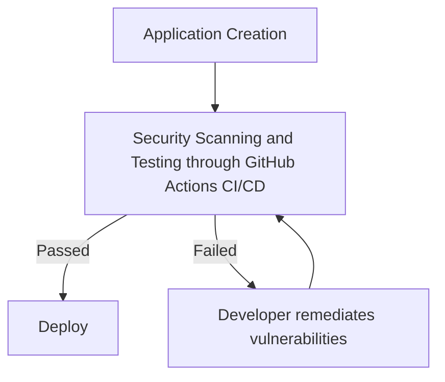
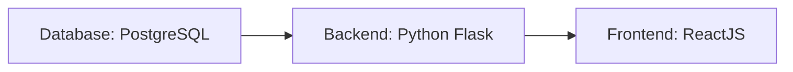
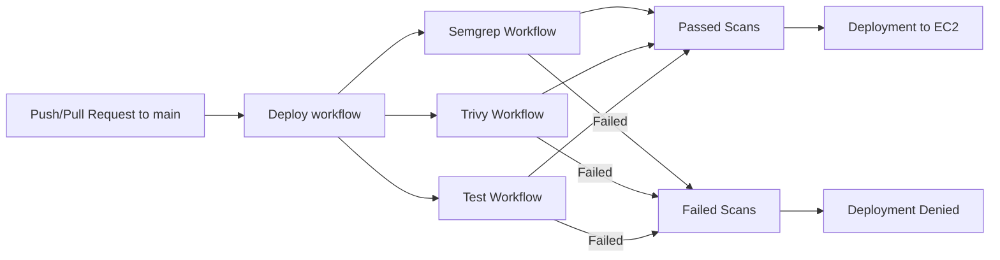

# OddJobs - Secure Software Deployment Pipeline

The goal of this project is to mimic and document the flow of full-stack application creation and secure deployment through a cloud service provider. The critical elements of this workflow include the following:

1. My Web Application (Titled: Odd Jobs)
2. CI/CD Pipeline (GitHub Actions)
3. Cloud provider service for deployment (AWS EC2)

## Project Workflow

The deployment of OddJobs will follow this workflow:



## Odd Jobs

OddJobs is a platform for those who need capable handyman work done in their homes or workplace. Whether you need a shelf fixed, a tv mounted, or a hole in the wall filled, this is the place for you.

This web application allows users to, upon signing up or logging in, to post jobs for things they need fixed or to sign up to complete jobs for other users on the platform. 

The web application follows this structure:



Each of these will be stored within their own docker containers. When a user accesses the website, the frontend container will perform API calls to the backend container in order to send, update, and retrieve data or info from the database container.

*****Note:***** While I do recognize that many businesses or enterprises would typically host these containers in separate EC2 or server clusters (and in the case of the database they may use the AWS Aurora RDS service), due to the smaller size and nature of this project, I thought it fit to run all of these containers in one EC2 instance.


## GitHub Actions Implementation and Vulnerability Remediation
### GitHub Workflows

This is a deeper dive into the deployment process of the OddJobs. Whenever pull request or push into main is created, the Deploy workflow is then triggered. The Deploy workflow then triggers the Semgrep, Trivy, and Test workflows. If all 3 of these workflows return successful scans, then the changes are redeay for deployment. However, if the scans fail, the changes will not be added to the main branch and  deployment will not occur.



### Deploy

This is the deploy workflow stored in .github/deploy.yml . This workflow's job is split into 2 steps. The first step is titled "Verify all Worflows passed." This is the step where the previously stated Semgrep, Trivy, and Test workflows are triggered. In the event that any of those scans have failed, this workflow does not move onto the next step, and effective blocks deployment.

The next step is titled "Deploy to EC2." In this step, now that the scans have passed, the github actions secrets stored for this repo (ODDJOBS_HOST for the public IP for the EC2 instance, ODDJOBS_USER for the username of the EC2 instance, ODDJOBS_SSH_KEY for the EC2 SSH key, and POSTGRES_USER, POSTGRES_PASSWORD, and POSTGRES_DB for the database credentials) are then used to log into the EC2 instance and create the containers for the backend, frontend, and database.


### Semgrep

Semgrep is a static analysis tool used for to find bugs, poor coding standards and vulnerabilities during code reviews of repos. This Semgrep workflow, found in .github/semgrep.yml, performs a scan for common python, javascript, and OWASP Top 10 vulnerabilities often found in code. In addition to this, I wrote a suite of semgrep rules for semgrep to scan for as well.


The custom semgrep rules are stored in ./semgrep/rules.yml . On the off chance that the OWASP Top 10 scans failed, I decided to scan for vulnerabilities that I was already aware of within this repo. These vulnerabilities match the Broken Access Control and Cryptographic Failure vulnerabilities found within OWASP Top 10 and have code patterns for how these vulnerabilities may appear.


### Trivy

Trivy is a security scan typically used for cloud native applications. In this project Trivy is used to scan the backend and frontend images that are created during deployment. the Trivy workflow, found in .github/trivy.yml, builds both the frontend and backend immages and scans those images to find vulnerabilities that currently can be remediated.


### Tests

This last workflow builds both the backend and frontend containers, and runs the suite of tests for each, ensuring there is a high level of functionality in both containers.


### Failed Scan Attempt

#### Failed Pull Request Scans

In my initial attempt to merge a functional version of the app to main, the deployment workflow ended in failure. As seen below, although it had passed the Test workflow and the Trivy workflow for the frontend, it failed the Trivy backend and Semgrep scans.


#### Semgrep scan

Here is the output of the failed Semgrep Scan:


#### Trivy Scan

Here is the output of the failed Trivy scan for the backend image:


### Remediation
______________________________________________________________________________________________________________________________________________________________________________________
***Dockerfiles***

In the Semgrep scan, one of the failures stated that there was no user outside of root for each container, meaning if an attacker were to attack the website, they would be doing so with root privileges. So the way to solve this issue would be to create another user, give that user appropriate privileges, and ensure that user is needed to run the starting commands without being the root user.

Here are the changes to the frontend dockerfile:

Before


After


As for the backend dockerfile we created another user as well, but that was not the only change necessary. The majority of the trivy python and environment issues came from using an outdated python base image and with outdated libraries. In addition to that, there was no prior initialization of a database before running the app, and the command in the backend dockerfile for running the app ```CMD ["python", "app.py"]``` is typically used for local/dev environment testing and not production. This means needing to make use of the latest version of Gunicorn was necessary. Gunicorn was already present, but at this time it was not used, so I decided to update it in the requirements.txt, and write a new command for running the backend app.

Here are the changes to requirements.txt:

Before


After


Here are the changes to the backend dockerfile:

Before


After


______________________________________________________________________________________________________________________________________________________________________________________
***App Initialization Changes***

Gunicorn vulnerability in Trivy
Gunicorn Remediation
app.py before and after

These three issues found within the Semgrep scan results above were found in /backend2/app.y:
- Semgrep.cors-allows-all-origins: CORS is configured with no origin restrictions. Any third-party website can make requests to this API. Restrict  your frontend. origin: ```CORS(app, origins=["https://yourdomain.com"])``` Found in /backend2/app.py.

      15| CORS(app)
  
- python.flask.security.audit.app-run-param-config.avoid_app_run_with_bad_host: Running flask app with host 0.0.0.0 could expose server publicly. Found in /backend2/app.py.
  
      46| app.run(host="0.0.0.0", port = 5000, debug=True)
  
- python.flask.security.audit.debug-enabled.debug-enabled: Detected Flask app with debug=True. Do not deploy production with this flag enabled as it will leak sensitive information. Instead, consider using Flask configuration variables or setting 'debug' using system environment variables. Found in /backend2/app.py.
  
      46| app.run(host="0.0.0.0", port = 5000, debug=True)

All of these vulnerabilities allow for an attacker to gain access or information passing through the backend server through API calls. In order to remediate them, I will perform these actions:

1. Specifiy an origin domain from which the requests the the backend originate.
2. Remove ```host="0.0.0.0"``` from the ```app.run()``` command.
3. Replace ```debug=True``` with ```debug=False```.

In addition, I created another file used for initializing the database and running the application (/backend/init_db.py) to be run as part of the gunicorn command in the backend dockerfile mentioned earlier.

Here is the /backend2/app.py file before the changes.


Here is the /backend2/app.py file after the changes and /backend/init_db.py .


***Backend functions and storage remediation***

The vulnerabilities returned by the semgrep scan regarding the backend models and routes all highlighted the insecure storage and comparison of user authentication information. Here are those vulnerabilities:

- semgrep.password-stored-as-plain-string: Password is stored as an unhashed string. Use a password hashing library to hash before storage. Found in /backend2/models2.py.

      10| password = db.Column(db.String(100), unique=False, nullable=False)  

- semgrep.raw-password-from-request: Password is taken directly from the request and passed unhashed into a model constructor. Hash the password before storing it. /backend2/routes.py.
  
- semgrep.password-compared-via-query: Password is compared by passing it directly into a database query. Replace by fetching the username only then verify the password using a hash comparison. /backend2/routes.py.

      68| user = User.query.filter_by(user_name=user_name, ***

In order to resolve these vulnerabilities, scenarios in which passwords are either stored or compared must be replaced with hash values of those passwords instead. Here are the steps that I took for remediation:

1. The first step I took was, in /backend/models2.py . Here I changed:

       10| password = db.Column(db.String(100), unique=False, nullable=False)
to:

       10| password_hash = db.Column(db.String(512), unique=False, nullable=False)

In the User class constructor. I also removed this from the User class's to_json() function:

        20| "password" : self.password,

These changes do not remediate the issue of plain-text password storage alone. That will be completed through the changes in /backend2/main.py . However, they do ensure that the semgrep scan does not return semgrep.password-stored-as-plain-string as a vulnerability, and it ensures that any call using the User.to_json() method does not return the password. That way the password of users cannot be returned when their other information is used in other functions.

Here is /backend2/models2.py before the remediations:


Here is /backend2/models2.py after the remediations:


______________________________________________________________________________________________________________________________________________________________________

2. The next set of changes I am looking to make is in the /backend2/routes.py . These changes will address the semgrep.raw-password-from-request and semgrep.password-compared-via-query vulnerabilities returned in the semgrep scan. The first step was to import a password hash generating library. For that I imported ```generate_password_hash``` and ```check_password_hash``` from the ```werkzeug.security``` library:

Before:


After:


Afterward, in order to address the semgrep.raw-password-from-request vulnerability, I made these changes to the create_user() function:

    33| password = request.json.get("password")

to

    33| raw_password = request.json.get("password")

and

    50| new_user = User(userid=userid, user_name=user_name, password=password, first_name=first_name, last_name=last_name, email=email)

to

    50| new_user = User(userid=userid, user_name=user_name, password_hash=generate_password_hash(raw_password), first_name=first_name, last_name=last_name, email=email)

These changes ensure that when a new user is created and stored, a hash is generated for the password that the user has entered and is stored as opposed to the the actual password itself.

Here is the create_user() function before the remediation:


Here is the create_user() function after the remediation:


_______________________________________________________________________________________________________________________________________________________________________


- Password Stored as plain text
- Raw password in request
- Password is compared by passing it through a query

 ________________________________________________________________________________________________________________________________________________________________________

______________________________________________________________________________________________________________________________________________________________________________________

***Nginx***

- Add app users
- running backend dockerfile using gunicorn
- Nginx change


#### Semgrep Vulnerabilities
#### Trivy Vulnerabilities


### Successful Scan


## Completed Deployment


## Issues and Troubleshooting
