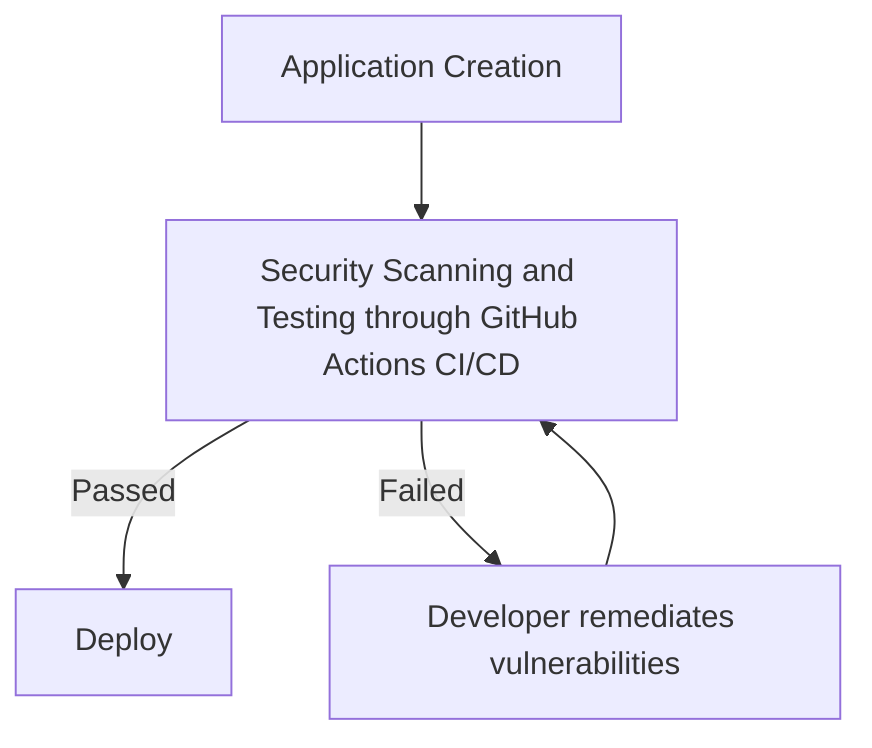
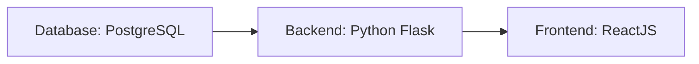
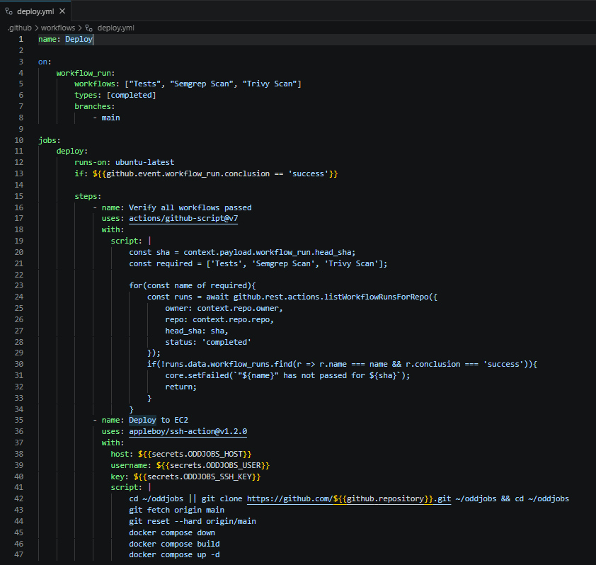
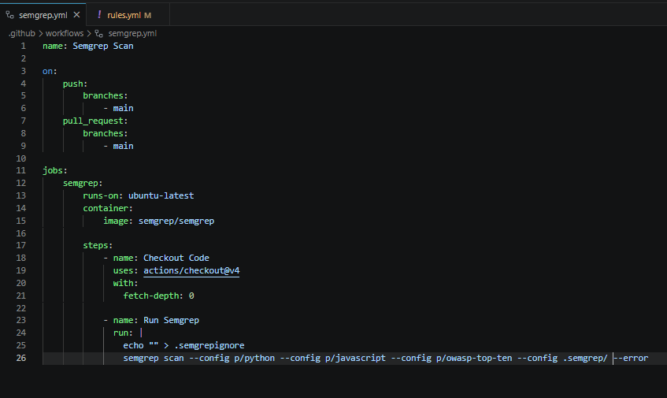
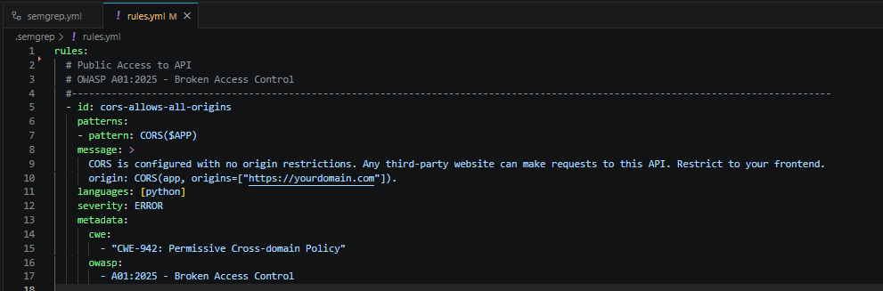
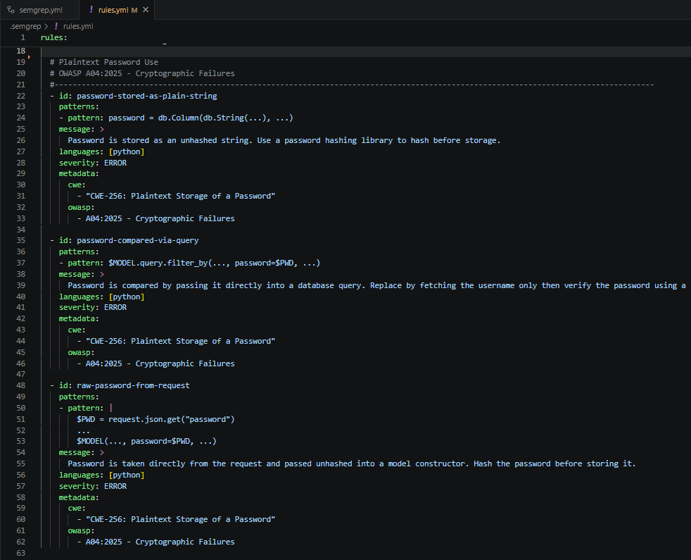

# OddJobs - Secure Software Deployment Pipeline

The goal of this project is to mimic and document the flow of full-stack application creation and secure deployment through a cloud service provider. The critical elements of this workflow include the following:

1. My Web Application (Titled: Odd Jobs)
2. CI/CD Pipeline (GitHub Actions)
3. Cloud provider service for deployment (AWS EC2)

## Project Workflow

The deployment of OddJobs will follow this workflow:

## Odd Jobs

OddJobs is a platform for those who need capable handyman work done in their homes or workplace. Whether you need a shelf fixed, a tv mounted, or a hole in the wall filled, this is the place for you.

This web application allows users to, upon signing up or logging in, to post jobs for things they need fixed or to sign up to complete jobs for other users on the platform. 

*** Include some screenshots of website here ***

The web application follows this structure:

Each of these will be stored within their own docker containers. When a user accesses the website, the frontend container will perform API calls to the backend container in order to send, update, and retrieve data or info from the database container.

*****Note:***** While I do recognize that many businesses or enterprises would typically host these containers in separate EC2 or server clusters (and in the case of the database they may use the AWS Aurora RDS service), due to the smaller size and nature of this project, I thought it fit to run all of these containers in one EC2 instance.

## GitHub Actions Implementation and Vulnerability Remediation
### GitHub Workflows

*** Worflow image and link ***
*** Pull Request and failure overview ***

### Semgrep

*** Semgrep file and rules file ***

### Trivy

*** Trivy scan file ***

### Tests

*** Tests scan file ***

### Failed Scan Attempt

#### Tests scan
#### Semgrep scan
#### Trivy Scan

### Remediation
### Successful Scan

## Completed Deployment

## Issues and Troubleshooting
